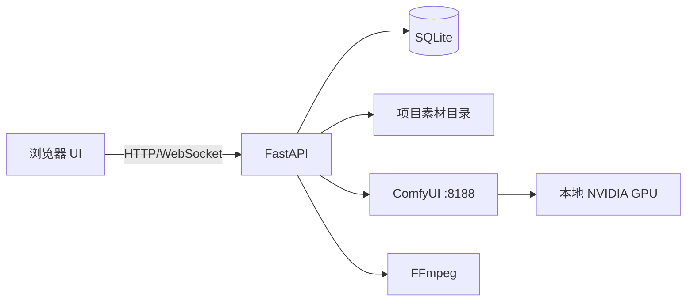
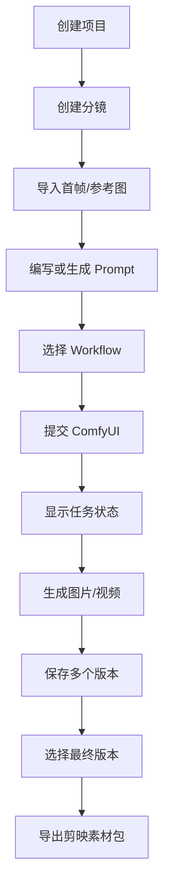
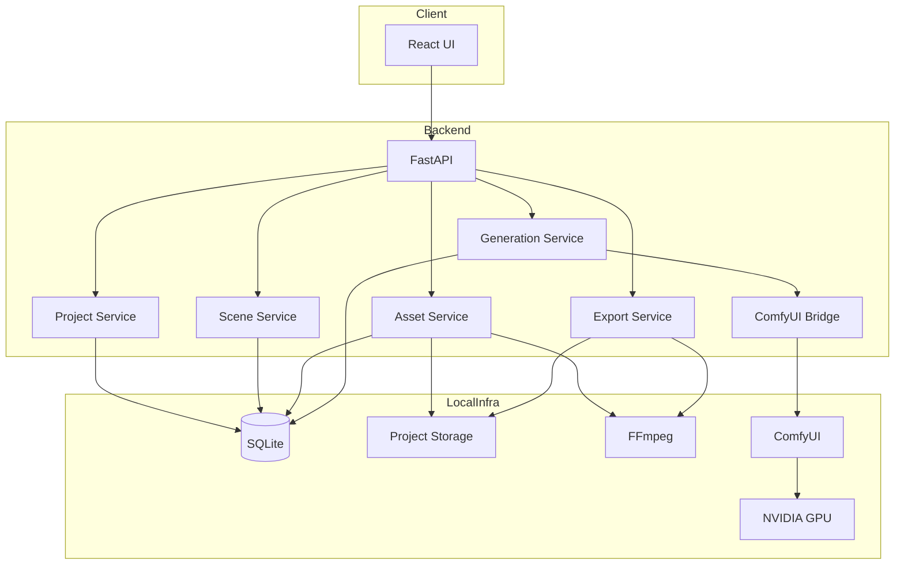
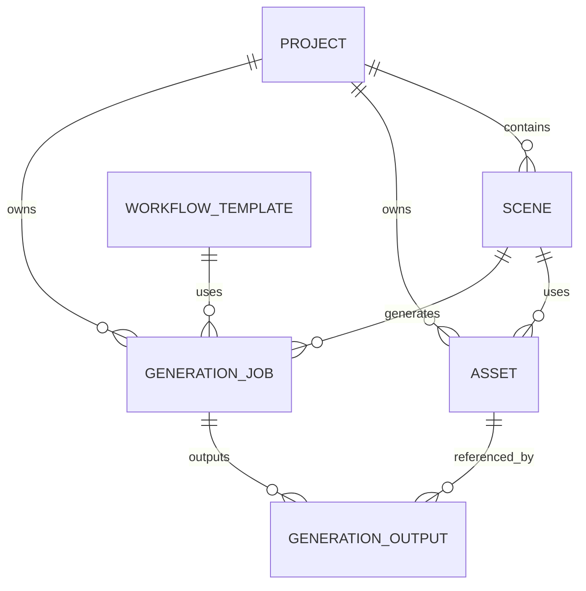
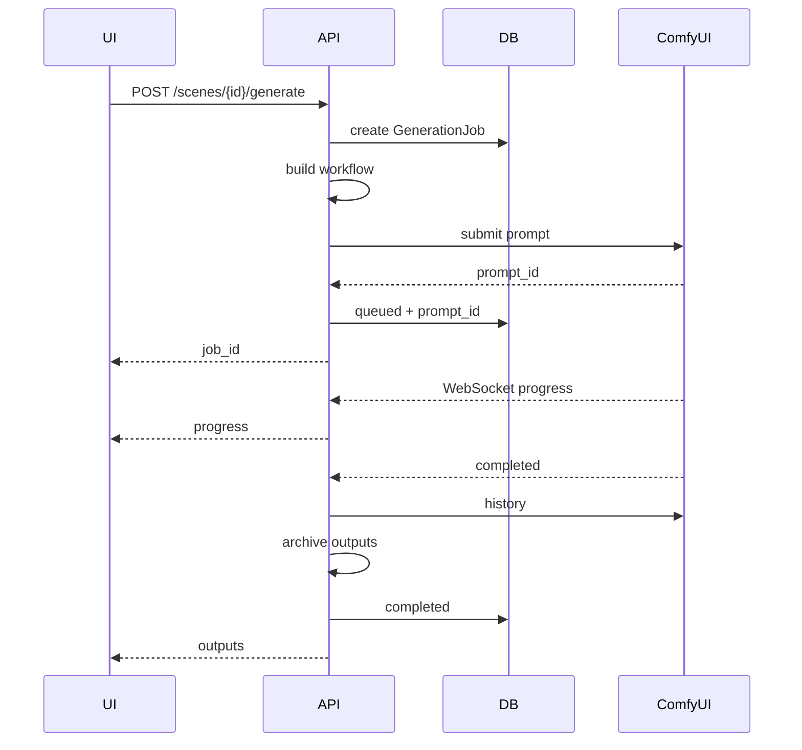

# AI Director V0.1 完整开发蓝图

本文件为便于直接交给 AI Coding Agent 阅读的合并版。


---

## 文件：README.md

# AI Director V0.1

面向本地 ComfyUI + AI 视频工作流的轻量“导演台”。

核心目标不是替代剪映，而是打通：

**故事/创意 → 项目 → 分镜 → 首帧/参考图 → Prompt → ComfyUI Workflow → 生成任务 → 多版本选择 → 素材导出 → 剪映后期**

## V0.1 范围

V0.1 必做：

- 项目管理
- 分镜管理
- 素材管理
- Prompt / Seed / Workflow 记录
- ComfyUI 连接检测
- Workflow 模板调用
- 生成任务队列
- 生成历史
- 图片/视频预览
- 失败重试
- 多版本结果
- 选中版本
- 素材包导出
- 日志

V0.1 不做：

- 剪映级时间轴
- 转场、滤镜、关键帧编辑器
- LoRA/模型训练
- 云端 GPU 集群
- 多人协作
- 账号会员系统
- 支付
- 完整云同步
- 模型下载管理器

## 推荐技术栈

### Frontend
- React
- TypeScript
- Vite
- Tailwind CSS
- shadcn/ui
- Zustand
- TanStack Query

### Backend
- Python 3.11
- FastAPI
- SQLAlchemy 2.x
- Pydantic
- SQLite
- WebSocket
- FFmpeg

### Desktop
V0.1 先浏览器运行，V0.3 之后再评估 Electron / Tauri。

## 本地运行拓扑



## 文档

- `docs/00_PRODUCT.md`
- `docs/01_ARCHITECTURE.md`
- `docs/02_DATABASE.md`
- `docs/03_API.md`
- `docs/04_UI.md`
- `docs/05_COMFYUI.md`
- `docs/06_ROADMAP.md`
- `docs/07_TASKS.md`
- `docs/08_CHANGELOG.md`

## 开发纪律

每个任务必须：

1. 先读 `AGENTS.md`
2. 只做一个任务
3. 不擅自重构
4. 不擅自升级依赖
5. 不擅自修改数据库结构
6. 完成后运行测试
7. 输出修改文件清单
8. 输出测试结果
9. 检查 `git diff`
10. 再进入下一个任务


---

## 文件：AGENTS.md

# AGENTS.md — AI Director 项目开发宪法

本文件对所有 AI Coding Agent 生效。

---

## 1. 项目定位

AI Director 是一个面向本地 AI 视频生产的导演台。

目标链路：

创意 → 项目 → 分镜 → Prompt/参考图 → ComfyUI → 生成任务 → 多版本 → 选择结果 → 导出剪映素材。

项目 **不是剪映替代品**。

---

## 2. 固定技术栈

未经明确批准，禁止更换：

### Frontend
- React
- TypeScript
- Vite
- Tailwind CSS
- shadcn/ui
- Zustand
- TanStack Query

### Backend
- Python 3.11
- FastAPI
- SQLAlchemy
- Pydantic
- SQLite
- WebSocket

### Media
- FFmpeg

---

## 3. 开发原则

### 3.1 最小修改原则
只修改完成当前任务所必需的文件。

### 3.2 禁止顺便优化
如果任务未要求，不得：
- 大范围重构
- 更换状态管理
- 更换 UI 框架
- 修改目录结构
- 修改数据库结构
- 升级依赖
- 删除接口
- 修改已有正常功能
- 修改 ComfyUI workflow
- 改变 API 返回格式

### 3.3 先理解再编码
开始任务前必须：
1. 阅读相关文档
2. 阅读现有实现
3. 确认影响范围
4. 给出简短实现计划
5. 再开始修改

---

## 4. 目录约束

```text
ai-director/
├─ apps/
│  ├─ web/
│  └─ api/
├─ data/
├─ projects/
├─ workflows/
├─ docs/
├─ prompts/
├─ tests/
├─ AGENTS.md
└─ README.md
```

禁止随意新建根目录。

---

## 5. Backend 分层

```text
apps/api/app/
├─ api/         # 路由
├─ models/      # SQLAlchemy ORM
├─ schemas/     # Pydantic
├─ services/    # 业务逻辑
├─ repositories/# 数据访问，可在需要时引入
├─ core/        # 配置、日志、异常
└─ main.py
```

规则：
- Route 不写复杂业务逻辑
- ComfyUI 调用放 `services/comfyui_*`
- 文件系统逻辑放 `services/storage_*`
- 数据库模型不要在任务外修改

---

## 6. Frontend 分层

```text
apps/web/src/
├─ components/
├─ features/
├─ pages/
├─ services/
├─ stores/
├─ hooks/
├─ types/
└─ utils/
```

规则：
- 页面组件不得直接写 fetch
- API 调用统一在 services
- 共享状态仅在确有必要时进入 Zustand
- 服务端状态优先 TanStack Query

---

## 7. API 规范

统一前缀：

`/api/v1`

成功：

```json
{
  "data": {},
  "error": null
}
```

失败：

```json
{
  "data": null,
  "error": {
    "code": "PROJECT_NOT_FOUND",
    "message": "Project not found"
  }
}
```

禁止：
- 同一类接口返回不同结构
- 将 Python traceback 直接返回前端

---

## 8. 数据库规范

- 主键：UUID 字符串
- 所有时间存 UTC
- 创建时间：`created_at`
- 更新时间：`updated_at`
- 删除优先软删除仅在业务确有必要时使用
- 不随意增加 JSON 大字段
- 文件本体不进数据库，只保存路径和元数据

数据库结构变更必须单独任务处理。

---

## 9. 文件路径规范

数据库保存“项目相对路径”，不要保存写死的 Windows 盘符。

推荐：

```text
projects/<project_id>/
├─ source/
├─ images/
├─ videos/
├─ audio/
├─ thumbnails/
├─ exports/
└─ metadata/
```

必须测试：
- 中文路径
- 空格路径
- 文件不存在
- 无权限
- 磁盘空间不足时的错误处理

---

## 10. ComfyUI 规范

禁止把某个模型写死进业务代码。

使用：

**WorkflowTemplate + 参数映射 + Prompt JSON**

所有模板必须可配置。

ComfyUI 连接信息通过配置：

```text
COMFYUI_BASE_URL=http://127.0.0.1:8188
```

生成流程必须支持：
- 健康检查
- 提交
- 队列
- 状态
- history
- WebSocket 进度
- 取消
- 失败
- 结果文件归档

---

## 11. Workflow 规范

`workflows/` 存放模板和参数描述。

每个模板至少包含：

```text
template.json
manifest.json
```

manifest 示例：

```json
{
  "id": "minimax-h3-i2v",
  "name": "MiniMax H3 I2V",
  "version": "1.0.0",
  "inputs": {
    "prompt": {"node_id": "12", "field": "text"},
    "seed": {"node_id": "41", "field": "noise_seed"},
    "image": {"node_id": "7", "field": "image"}
  }
}
```

禁止在服务代码中通过猜节点名修改 workflow。

---

## 12. 生成任务规范

状态固定：

```text
pending
queued
running
completed
failed
cancelled
```

任何生成任务必须记录：
- scene_id
- workflow_template_id
- workflow_version
- prompt
- negative_prompt
- seed
- 参数快照
- ComfyUI prompt_id
- 状态
- 开始时间
- 完成时间
- 错误信息

---

## 13. 日志规范

至少：
- `logs/app.log`
- `logs/comfyui.log`
- `logs/generation.log`

禁止打印敏感信息。

错误日志必须包含：
- job_id
- project_id（如有）
- scene_id（如有）
- comfyui prompt_id（如有）

---

## 14. 测试规范

每个核心模块至少覆盖：

### Project
- create
- list
- get
- update
- delete

### Scene
- create
- reorder
- update
- delete
- 自动 scene_number

### Generation
- ComfyUI 离线
- 提交成功
- 提交失败
- 任务完成
- 任务失败
- 取消
- 重试

### Storage
- 中文路径
- 文件不存在
- 重名
- 不支持格式

---

## 15. Git 规范

分支：

```text
main
dev
feature/<task-name>
fix/<bug-name>
```

Commit 建议：

```text
feat(scene): add scene create api
fix(comfyui): handle websocket disconnect
test(project): add project api tests
docs: update api spec
```

每个 Task 尽量一个独立 commit。

---

## 16. 每个任务的执行模板

开始时输出：

```text
理解：
影响文件：
实现计划：
风险：
```

完成时输出：

```text
已完成：
修改文件：
测试：
git diff 摘要：
仍存在的问题：
```

---

## 17. 禁止事项

除非用户明确要求：

- 不做剪辑时间线引擎
- 不训练模型
- 不接支付
- 不接会员
- 不做多租户
- 不上 Kubernetes
- 不上微服务
- 不引入 Redis
- 不引入 PostgreSQL
- 不做云 GPU 调度
- 不写自动更新器
- 不做模型下载器


---

## 文件：docs/00_PRODUCT.md

# 00_PRODUCT — 产品需求定义

## 1. 产品名称

暂定：**AI Director / AI 视频导演台**

---

## 2. 核心问题

目前 AI 视频生产存在大量割裂：

- 故事在聊天工具
- Prompt 在笔记或聊天记录
- 图片在文件夹
- 视频在 ComfyUI 输出目录
- Seed/参数难追溯
- Workflow 容易忘记使用版本
- 多个生成版本难管理
- 最终还要手动拖入剪映

AI Director 负责把这些生产资料组织起来。

---

## 3. 核心用户流程



---

## 4. V0.1 必做

### 项目
- 创建
- 编辑
- 删除
- 项目列表
- 分辨率/比例/fps

### 分镜
- 新建
- 编辑
- 删除
- 排序
- 编号
- Prompt
- Negative Prompt
- Seed
- 时长
- Workflow

### 素材
- 图片
- 视频
- 音频
- 参考图
- 缩略图
- 预览

### ComfyUI
- 状态检测
- workflow 提交
- queue
- history
- WebSocket 进度
- 结果抓取
- 错误记录

### 生成
- 单镜头生成
- 失败重试
- 取消
- 生成历史
- 多版本
- 选择最终版本

### 导出
- 按分镜顺序导出
- 视频命名
- SRT 占位支持
- JSON 清单

---

## 5. V0.1 不做

- 剪映完整时间轴
- 关键帧
- 视频转场
- 滤镜系统
- GPU 云集群
- 多人实时协作
- 复杂权限
- 付费体系
- 模型训练
- 模型下载器
- 自动安装 ComfyUI

---

## 6. 成功标准

V0.1 完成后，用户可以：

1. 新建一个“布布二故事”项目
2. 建立 6 个分镜
3. 每个分镜上传首帧
4. 写 Prompt
5. 选择 MiniMax H3 workflow
6. 点击生成
7. 看到队列与进度
8. 每个镜头生成 2~3 个版本
9. 选择最终版本
10. 一键导出 01.mp4 ~ 06.mp4
11. 拖入剪映继续制作

满足以上即算 V0.1 成功。


---

## 文件：docs/01_ARCHITECTURE.md

# 01_ARCHITECTURE — 系统架构

## 1. 总体架构



---

## 2. 本地优先

V0.1 推荐全部部署在本机：

```text
Windows
├─ AI Director Web
├─ AI Director API
├─ SQLite
├─ ComfyUI
├─ FFmpeg
└─ 本地项目素材
```

原因：
- ComfyUI 与导演台通信频繁
- 大文件不需要上传云
- 本地 GPU 成本低
- Workflow 和模型路径本地化
- 更方便调试

---

## 3. 未来云端边界

未来如需云服务：

### 云端适合
- 项目 metadata 备份
- Prompt 同步
- Workflow 描述同步
- 远程控制入口
- 用户认证

### 云端暂不适合
- 大模型文件
- 大量原始视频
- 本地 ComfyUI 推理
- 复杂 GPU 调度

---

## 4. 未来远程 Worker


此架构仅 V1.0 以后评估。

---

## 5. 通信方式

Frontend → Backend：
- REST：CRUD
- WebSocket：生成进度

Backend → ComfyUI：
- HTTP：提交、队列、history
- WebSocket：节点执行进度

---

## 6. 关键技术决策

### Decision A
不直接从浏览器访问 ComfyUI。

原因：
- 文件处理
- 安全
- workflow 参数映射
- 日志
- 重试
- 数据持久化

全部统一经过 FastAPI。

### Decision B
不把 workflow 写死在代码。

使用模板与 manifest。

### Decision C
不把视频二进制写入 SQLite。

数据库只保存 metadata 和路径。

### Decision D
前端不直接依赖本地磁盘路径。

素材通过 API 获取可访问 URL。


---

## 文件：docs/02_DATABASE.md

# 02_DATABASE — 数据库设计

## 1. Project

| 字段 | 类型 | 说明 |
|---|---|---|
| id | UUID | 主键 |
| name | string | 项目名 |
| description | text | 描述 |
| aspect_ratio | string | 16:9 / 9:16 |
| width | int | 宽 |
| height | int | 高 |
| fps | int | 帧率 |
| created_at | datetime | 创建时间 |
| updated_at | datetime | 更新时间 |

---

## 2. Scene

| 字段 | 类型 | 说明 |
|---|---|---|
| id | UUID | 主键 |
| project_id | UUID | 项目 |
| scene_number | int | 分镜序号 |
| title | string | 标题 |
| description | text | 内容 |
| prompt | text | Prompt |
| negative_prompt | text | Negative |
| seed | bigint/null | Seed |
| duration_seconds | float | 时长 |
| workflow_template_id | UUID/null | 默认 workflow |
| selected_asset_id | UUID/null | 最终版本 |
| status | string | draft/ready/generating/completed |
| created_at | datetime | 创建 |
| updated_at | datetime | 更新 |

约束：
- `(project_id, scene_number)` 唯一

---

## 3. Asset

| 字段 | 类型 | 说明 |
|---|---|---|
| id | UUID | 主键 |
| project_id | UUID | 项目 |
| scene_id | UUID/null | 分镜 |
| type | enum | image/video/audio/reference |
| role | string | first_frame/output/reference/voice/bgm |
| relative_path | string | 项目相对路径 |
| thumbnail_path | string/null | 缩略图 |
| mime_type | string | MIME |
| width | int/null | 宽 |
| height | int/null | 高 |
| duration_seconds | float/null | 时长 |
| size_bytes | bigint | 大小 |
| hash | string/null | 文件哈希 |
| created_at | datetime | 创建 |

---

## 4. WorkflowTemplate

| 字段 | 类型 |
|---|---|
| id | UUID |
| name | string |
| slug | string |
| version | string |
| template_path | string |
| manifest_path | string |
| is_enabled | bool |
| created_at | datetime |
| updated_at | datetime |

---

## 5. GenerationJob

| 字段 | 类型 |
|---|---|
| id | UUID |
| project_id | UUID |
| scene_id | UUID |
| workflow_template_id | UUID |
| workflow_version | string |
| comfy_prompt_id | string/null |
| status | enum |
| prompt_snapshot | text |
| negative_prompt_snapshot | text/null |
| seed | bigint/null |
| params_json | json |
| error_code | string/null |
| error_message | text/null |
| started_at | datetime/null |
| finished_at | datetime/null |
| created_at | datetime |

状态：
- pending
- queued
- running
- completed
- failed
- cancelled

---

## 6. GenerationOutput

允许一个任务产生多个输出。

| 字段 | 类型 |
|---|---|
| id | UUID |
| generation_job_id | UUID |
| asset_id | UUID |
| output_index | int |

---

## 7. Character（V0.2 可提前建表但不开放 UI）

| 字段 | 类型 |
|---|---|
| id | UUID |
| name | string |
| description | text |
| prompt_prefix | text |
| negative_prompt | text |
| default_workflow_id | UUID/null |
| created_at | datetime |

---

## 8. 关系




---

## 文件：docs/03_API.md

# 03_API — API 设计

统一前缀：

`/api/v1`

---

## Health

### GET /health

返回服务状态。

### GET /comfyui/health

检测 ComfyUI。

---

## Projects

### GET /projects
项目列表

### POST /projects
创建项目

### GET /projects/{id}
项目详情

### PATCH /projects/{id}
修改项目

### DELETE /projects/{id}
删除项目

---

## Scenes

### GET /projects/{project_id}/scenes
获取分镜

### POST /projects/{project_id}/scenes
创建分镜

### GET /scenes/{id}
详情

### PATCH /scenes/{id}
更新

### DELETE /scenes/{id}
删除

### POST /projects/{project_id}/scenes/reorder
重新排序

Body：

```json
{
  "scene_ids": ["uuid1", "uuid2", "uuid3"]
}
```

---

## Assets

### POST /projects/{project_id}/assets/upload
上传素材

### GET /assets/{id}
素材信息

### GET /assets/{id}/content
查看文件

### DELETE /assets/{id}
删除素材

### POST /scenes/{scene_id}/assets/{asset_id}/select
设为选中版本

---

## Workflows

### GET /workflow-templates
模板列表

### GET /workflow-templates/{id}
模板信息

### POST /workflow-templates/import
导入 workflow 模板

### POST /workflow-templates/{id}/validate
验证参数映射

---

## Generation

### POST /scenes/{scene_id}/generate
创建生成任务

建议 Body：

```json
{
  "workflow_template_id": "uuid",
  "seed": 123456,
  "params": {
    "frames": 81,
    "cfg": 5
  }
}
```

### GET /generation-jobs/{id}
任务详情

### GET /scenes/{scene_id}/generation-jobs
生成历史

### POST /generation-jobs/{id}/cancel
取消

### POST /generation-jobs/{id}/retry
重试

---

## WebSocket

### /ws/generation

事件示例：

```json
{
  "type": "generation.progress",
  "job_id": "uuid",
  "scene_id": "uuid",
  "progress": 0.42,
  "node_id": "38"
}
```

完成：

```json
{
  "type": "generation.completed",
  "job_id": "uuid",
  "outputs": ["asset_uuid"]
}
```

失败：

```json
{
  "type": "generation.failed",
  "job_id": "uuid",
  "error_code": "COMFYUI_EXECUTION_ERROR",
  "message": "CUDA out of memory"
}
```

---

## Export

### POST /projects/{project_id}/exports

Body：

```json
{
  "mode": "selected_versions",
  "include_manifest": true,
  "include_subtitles": true
}
```

返回导出任务/路径。


---

## 文件：docs/04_UI.md

# 04_UI — UI 设计规范

## 1. 主布局

目标接近“导演台”，但不做剪辑器。

```text
┌──────────────┬──────────────────────────────────────┬──────────────┐
│ 项目侧边栏   │ 分镜工作区                           │ 操作侧边栏   │
│              │                                      │              │
│ 项目 A       │ 01 [首帧] [视频] Prompt Workflow... │ 导入素材     │
│ 项目 B       │ 02 [首帧] [视频] Prompt Workflow... │ 批量生成     │
│ 项目 C       │ 03 ...                               │ 导出素材     │
│              │                                      │ ComfyUI状态  │
└──────────────┴──────────────────────────────────────┴──────────────┘
```

---

## 2. 左侧 Project Sidebar

显示：
- 项目名称
- 分镜数量
- 新建项目
- 当前选中项目

不显示复杂信息。

---

## 3. 顶栏

显示：
- 项目名
- 比例
- 分辨率
- FPS
- 总时长
- 分镜数
- ComfyUI 状态

---

## 4. Scene Card

第一版建议字段：

```text
[拖拽] 01
首帧缩略图
生成视频缩略图

标题
Prompt 摘要
Workflow
Seed
时长
状态

[生成] [重试] [更多]
```

不要一次显示所有采样参数。

---

## 5. Scene Detail Drawer

点击 Scene 打开右侧抽屉：

### 基础
- 标题
- 描述
- 时长

### Prompt
- Prompt
- Negative Prompt

### 生成
- Workflow
- Seed
- Workflow 参数

### 素材
- 首帧
- 参考图
- 输出版本

---

## 6. Generation Status

必须明确：

- 待处理
- 排队
- 生成中
- 已完成
- 失败
- 已取消

生成中显示：
- 总体百分比
- 当前 node（如果可获取）
- 已耗时

---

## 7. 版本管理

每个 Scene 可出现：

```text
Version 1
Version 2
Version 3 ★ selected
```

选择后写入 `selected_asset_id`。

---

## 8. 视觉原则

- 深色界面优先
- 卡片层级清晰
- 信息密度高但不拥挤
- 主要操作突出
- 复杂参数放 Drawer
- 主工作区尽量少弹窗
- 错误提示必须可复制


---

## 文件：docs/05_COMFYUI.md

# 05_COMFYUI — ComfyUI 集成设计

## 1. 目标

导演台不替代 ComfyUI。

导演台仅：
- 选择模板
- 填参数
- 提交
- 监控
- 保存生成结果

---

## 2. ComfyUI Bridge

建议服务：

```text
services/
├─ comfyui_client.py
├─ comfyui_workflow.py
├─ comfyui_events.py
└─ generation_service.py
```

职责：

### comfyui_client
- health
- submit prompt
- queue
- history
- interrupt

### comfyui_workflow
- 加载模板
- 参数替换
- manifest 验证
- 输出最终 Prompt JSON

### comfyui_events
- WebSocket
- progress
- executing
- executed
- error

### generation_service
- Job 生命周期
- DB
- 输出文件归档
- 错误转换

---

## 3. Workflow Template

目录：

```text
workflows/
└─ minimax-h3-i2v/
   ├─ template.json
   └─ manifest.json
```

manifest：

```json
{
  "id": "minimax-h3-i2v",
  "name": "MiniMax H3 I2V",
  "version": "1.0.0",
  "description": "MiniMax H3 image-to-video workflow",
  "inputs": {
    "prompt": {
      "node_id": "12",
      "field": "text",
      "type": "string",
      "required": true
    },
    "seed": {
      "node_id": "45",
      "field": "noise_seed",
      "type": "integer",
      "required": true
    },
    "image": {
      "node_id": "7",
      "field": "image",
      "type": "asset"
    }
  }
}
```

---

## 4. 参数替换

不使用字符串搜索替换。

使用：
- node_id
- inputs[field]

例如：

```python
workflow["12"]["inputs"]["text"] = prompt
```

必须由 manifest 驱动。

---

## 5. 提交流程



---

## 6. 错误类型

至少归一化：

```text
COMFYUI_OFFLINE
COMFYUI_TIMEOUT
WORKFLOW_INVALID
WORKFLOW_NODE_MISSING
INPUT_FILE_MISSING
MODEL_MISSING
CUDA_OOM
EXECUTION_FAILED
OUTPUT_NOT_FOUND
CANCELLED
```

---

## 7. 重试

Retry 默认：
- 复制原 Job 参数快照
- 创建新 Job
- 不覆盖旧 Job

这样历史可追溯。

---

## 8. 输出归档

不要长期依赖 ComfyUI/output。

生成完成后，复制/移动到：

```text
projects/<project_id>/videos/
projects/<project_id>/images/
```

再建立 Asset。

---

## 9. CUDA OOM

UI 错误应该显示可理解文本：

```text
生成失败：显存不足（CUDA OOM）
Workflow：MiniMax H3 I2V
Scene：03
Job：...
```

并保留原始错误到日志。


---

## 文件：docs/06_ROADMAP.md

# 06_ROADMAP — 版本路线

## V0.1 — 可用导演台

目标：真正开始日常使用。

- 项目
- 分镜
- 素材
- Prompt
- Seed
- Workflow
- ComfyUI Bridge
- 单任务生成
- 队列状态
- WebSocket 进度
- 历史
- 多版本
- 选择最终版本
- 导出
- 日志

完成标准：
能完整制作一个 6 镜头短片并导出给剪映。

---

## V0.2 — AI 视频生产增强

- Character Library
- 固定角色 Prompt
- 参考图集合
- Workflow 参数面板
- 批量生成
- 批量重试
- Workflow 版本管理
- 生成收藏/评分
- 项目模板

---

## V0.3 — AI Director

- 故事拆分
- 自动分镜
- 首帧 Prompt
- 视频 Prompt
- 镜头语言
- 场景连续性检查
- 角色一致性提示
- Prompt 补全
- 批量写入 Scene

---

## V0.4 — 音频与预览

- TTS
- 音频导入
- BGM
- SRT
- 简易顺序播放
- 总时长预览

仍不做：
剪映级时间线。

---

## V0.5 — 剪映工作流增强

- 导出视频序列
- SRT
- 音频
- 项目 manifest
- 剪辑清单
- 素材重命名
- 可选代理文件

---

## V1.0 — 远程导演台

可选：
- Cloud metadata
- 远程控制 Local Worker
- 多设备项目查看
- 本地 Worker 安全连接

此阶段再评估云服务。


---

## 文件：docs/07_TASKS.md

# 07_TASKS — V0.1 任务清单

规则：一次只执行一个 Task；每个 Task 建议单独分支/commit。

| ID | 任务 | 范围 | 验收 |
|---|---|---|---|
| TASK-001 | 初始化 Git 仓库与目录结构 | 创建固定项目目录；不实现业务。 | 目录符合 AGENTS.md；Git 可正常工作。 |
| TASK-002 | 初始化 React + TypeScript + Vite | 建立 apps/web 并可启动。 | npm run dev 成功；无控制台致命错误。 |
| TASK-003 | 建立三栏主布局 | 左项目栏、中分镜区、右操作栏，仅静态。 | 布局在 1440p 下正常；可响应窗口缩放。 |
| TASK-004 | 初始化 FastAPI | 建立 apps/api 与 GET /api/v1/health。 | uvicorn 可启动；/docs 可访问。 |
| TASK-005 | 建立配置系统 | 支持 APP_DATA_DIR、COMFYUI_BASE_URL 等配置。 | 默认值可运行；环境变量可覆盖。 |
| TASK-006 | 建立日志系统 | app/comfyui/generation 三类 logger。 | 日志文件可写；错误含 timestamp。 |
| TASK-007 | 初始化 SQLite + SQLAlchemy | 建立 DB session/base。 | 启动可创建数据库。 |
| TASK-008 | 实现 Project 模型与 schema | 实现 Project ORM + Pydantic。 | 字段符合数据库文档。 |
| TASK-009 | 实现 Project CRUD API | list/create/get/update/delete。 | API 测试通过。 |
| TASK-010 | 实现 Project Sidebar | 前端接 Project API。 | 新建项目后左侧立即出现。 |
| TASK-011 | 实现 Scene 模型与 schema | 实现 Scene ORM。 | project_id + scene_number 约束正确。 |
| TASK-012 | 实现 Scene 创建 API | 自动 scene_number。 | 连续创建返回 1/2/3。 |
| TASK-013 | 实现 Scene CRUD API | list/get/update/delete。 | CRUD 测试通过。 |
| TASK-014 | 实现 Scene reorder API | 批量更新 scene_number。 | 拖拽序列能可靠保存。 |
| TASK-015 | 实现 Scene Card | 显示编号、标题、Prompt 摘要、状态。 | 列表正常渲染。 |
| TASK-016 | 实现分镜拖拽排序 | 前端拖拽并调用 reorder。 | 刷新后顺序保持。 |
| TASK-017 | 实现 Scene Detail Drawer | 编辑标题、描述、Prompt、Seed、时长。 | 保存后立即同步。 |
| TASK-018 | 实现 Asset 模型 | 建立素材 metadata。 | 字段符合文档。 |
| TASK-019 | 实现素材上传 API | 支持 image/video/audio/reference。 | 中文文件名可上传。 |
| TASK-020 | 实现素材文件访问 | content 与 thumbnail 接口。 | 前端可以预览。 |
| TASK-021 | 接入 FFmpeg metadata | 读取视频时长、分辨率。 | 视频上传后 metadata 正确。 |
| TASK-022 | 生成视频缩略图 | FFmpeg 抽帧。 | 视频卡片有缩略图。 |
| TASK-023 | 实现 WorkflowTemplate 模型 | 保存模板 metadata。 | 可导入模板记录。 |
| TASK-024 | 实现 Workflow manifest 加载器 | 读取 template.json + manifest.json。 | 错误映射可被识别。 |
| TASK-025 | 实现 Workflow 参数替换 | 按 node_id/field 修改 JSON。 | 单元测试验证不改其他节点。 |
| TASK-026 | 实现 ComfyUI health | GET /comfyui/health。 | 离线/在线状态正确。 |
| TASK-027 | 实现 ComfyUI submit | 提交 Prompt JSON 并获取 prompt_id。 | 测试使用 mock 或可控环境。 |
| TASK-028 | 实现 GenerationJob 模型 | 记录任务完整快照。 | 状态机字段正确。 |
| TASK-029 | 实现 Scene Generate API | 创建 Job + 提交 ComfyUI。 | 返回 job_id；DB 保存 prompt_id。 |
| TASK-030 | 实现 ComfyUI WebSocket 监听 | 接收执行进度/完成/错误。 | 断线不会导致 API 崩溃。 |
| TASK-031 | 实现前端生成状态 | 显示 queued/running/completed/failed。 | 状态可实时更新。 |
| TASK-032 | 实现生成结果归档 | 从 ComfyUI history 获取并归档 Asset。 | 结果进入项目目录而非只留在 ComfyUI/output。 |
| TASK-033 | 实现生成历史与多版本 | Scene 显示历史输出。 | 可查看至少 3 个版本。 |
| TASK-034 | 实现 Selected Version | 可把一个 Asset 设为最终版本。 | 刷新后 selected 状态保持。 |
| TASK-035 | 实现取消/失败重试 | cancel + retry。 | 重试产生新 Job，不覆盖旧记录。 |
| TASK-036 | 实现导出服务 | 按 scene_number 导出 selected 版本。 | 输出 01_xxx.mp4、02_xxx.mp4。 |
| TASK-037 | 导出 manifest.json | 包含场景、Prompt、Seed、workflow、文件名。 | JSON 可读且信息完整。 |
| TASK-038 | 前端导出面板 | 右侧操作区增加导出。 | 可触发并显示导出路径。 |
| TASK-039 | 错误统一与 Toast | 统一 API error 结构。 | ComfyUI 离线/OOM 能显示清楚。 |
| TASK-040 | 核心集成测试 | 覆盖 Project→Scene→Generate→Output→Export。 | 核心链路测试通过。 |

## 推荐阶段

### Milestone A — Skeleton
TASK-001 ~ TASK-007

### Milestone B — Project & Scene
TASK-008 ~ TASK-017

### Milestone C — Assets
TASK-018 ~ TASK-022

### Milestone D — Workflow & ComfyUI
TASK-023 ~ TASK-032

### Milestone E — Version & Export
TASK-033 ~ TASK-040

## 第一阶段完成条件

只有当 TASK-001 ~ TASK-017 全部稳定后，才建议正式接 ComfyUI。

这样可以避免 UI、数据库和 ComfyUI 三条线同时出错。


---

## 文件：docs/08_CHANGELOG.md

# 08_CHANGELOG

## [Unreleased]

### Planned
- V0.1 project skeleton
- Project CRUD
- Scene board
- Asset management
- ComfyUI bridge
- Generation jobs
- Export

---

## 版本规范

建议使用：

`MAJOR.MINOR.PATCH`

例如：

- 0.1.0：首个可用导演台
- 0.2.0：角色库与批量生成
- 0.3.0：AI Director
- 1.0.0：稳定正式版
