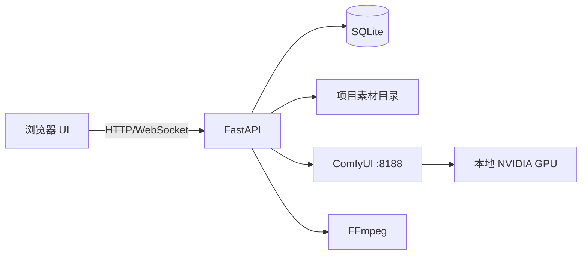

# AI Director V0.1

面向本地 ComfyUI + AI 视频工作流的轻量“导演台”。

核心目标不是替代剪映，而是打通：

**故事/创意 → 项目 → 分镜 → 首帧/参考图 → Prompt → ComfyUI Workflow → 生成任务 → 多版本选择 → 素材导出 → 剪映后期**

## Current Status

V0.1 核心 backend、生成与导出链路已完成，当前进入 **V0.1 Closure Phase**。

已完成：

- Project / Scene
- Assets backend
- Workflow core
- ComfyUI generation 与 WebSocket
- Generation history、Selected Version、Retry / Cancel
- Project Export、manifest.json、ZIP download

待完成 V0.1：

- Scene create/delete UI
- Asset import 与 reference management UI
- Workflow API 与 Scene workflow selection UI
- TopBar real Project 与 ComfyUI health status
- Unified frontend API error UX
- Core V0.1 integration test

## V0.1 范围

V0.1 必做：

- 项目管理
- 分镜管理
- 素材管理
- Prompt / Seed / Workflow 记录
- ComfyUI 连接检测
- Workflow 模板调用
- 生成任务队列
- 生成历史
- 图片/视频预览
- 失败重试
- 多版本结果
- 选中版本
- 素材包导出
- 日志

V0.1 不做：

- 剪映级时间轴
- 转场、滤镜、关键帧编辑器
- LoRA/模型训练
- 云端 GPU 集群
- 多人协作
- 账号会员系统
- 支付
- 完整云同步
- 模型下载管理器

## 推荐技术栈

### Frontend
- React
- TypeScript
- Vite
- Tailwind CSS
- shadcn/ui
- Zustand
- TanStack Query

### Backend
- Python 3.11
- FastAPI
- SQLAlchemy 2.x
- Pydantic
- SQLite
- WebSocket
- FFmpeg

### Desktop
V0.1 先浏览器运行，V0.3 之后再评估 Electron / Tauri。

## 本地运行拓扑

## 文档

- `docs/00_PRODUCT.md`
- `docs/01_ARCHITECTURE.md`
- `docs/02_DATABASE.md`
- `docs/03_API.md`
- `docs/04_UI.md`
- `docs/05_COMFYUI.md`
- `docs/06_ROADMAP.md`
- `docs/07_TASKS.md`
- `docs/08_CHANGELOG.md`

## 开发纪律

每个任务必须：

1. 先读 `AGENTS.md`
2. 只做一个任务
3. 不擅自重构
4. 不擅自升级依赖
5. 不擅自修改数据库结构
6. 完成后运行测试
7. 输出修改文件清单
8. 输出测试结果
9. 检查 `git diff`
10. 再进入下一个任务
