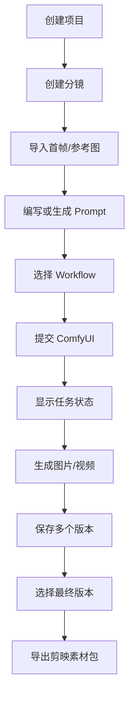

# 00_PRODUCT — 产品需求定义

## 1. 产品名称

暂定：**AI Director / AI 视频导演台**

---

## 2. 核心问题

目前 AI 视频生产存在大量割裂：

- 故事在聊天工具
- Prompt 在笔记或聊天记录
- 图片在文件夹
- 视频在 ComfyUI 输出目录
- Seed/参数难追溯
- Workflow 容易忘记使用版本
- 多个生成版本难管理
- 最终还要手动拖入剪映

AI Director 负责把这些生产资料组织起来。

---

## 3. 核心用户流程

---

## 4. V0.1 必做

### 项目
- 创建
- 编辑
- 删除
- 项目列表
- 分辨率/比例/fps

### 分镜
- 新建
- 编辑
- 删除
- 排序
- 编号
- Prompt
- Negative Prompt
- Seed
- 时长
- Workflow

### 素材
- 图片
- 视频
- 音频
- 参考图
- 缩略图
- 预览

### ComfyUI
- 状态检测
- workflow 提交
- queue
- history
- WebSocket 进度
- 结果抓取
- 错误记录

### 生成
- 单镜头生成
- 失败重试
- 取消
- 生成历史
- 多版本
- 选择最终版本

### 导出
- 按分镜顺序导出
- 视频命名
- SRT 占位支持
- JSON 清单

---

## 5. V0.1 不做

- 剪映完整时间轴
- 关键帧
- 视频转场
- 滤镜系统
- GPU 云集群
- 多人实时协作
- 复杂权限
- 付费体系
- 模型训练
- 模型下载器
- 自动安装 ComfyUI

---

## 6. 成功标准

V0.1 完成后，用户可以：

1. 新建一个“布布二故事”项目
2. 建立 6 个分镜
3. 每个分镜上传首帧
4. 写 Prompt
5. 选择 MiniMax H3 workflow
6. 点击生成
7. 看到队列与进度
8. 每个镜头生成 2~3 个版本
9. 选择最终版本
10. 一键导出 01.mp4 ~ 06.mp4
11. 拖入剪映继续制作

满足以上即算 V0.1 成功。
