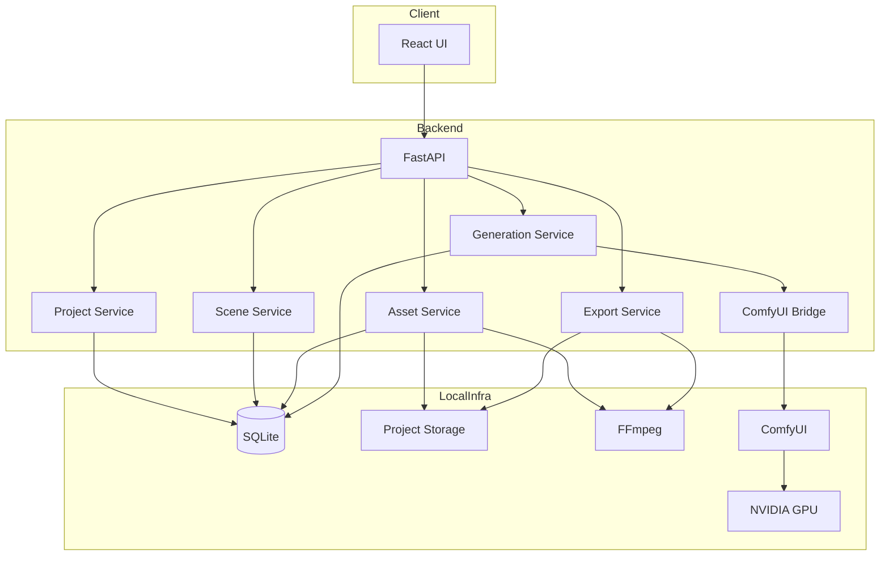
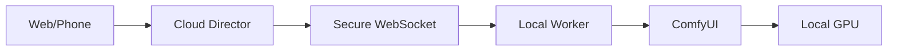

# 01_ARCHITECTURE — 系统架构

## 1. 总体架构



---

## 2. 本地优先

V0.1 推荐全部部署在本机：

```text
Windows
├─ AI Director Web
├─ AI Director API
├─ SQLite
├─ ComfyUI
├─ FFmpeg
└─ 本地项目素材
```

原因：
- ComfyUI 与导演台通信频繁
- 大文件不需要上传云
- 本地 GPU 成本低
- Workflow 和模型路径本地化
- 更方便调试

---

## 3. 未来云端边界

未来如需云服务：

### 云端适合
- 项目 metadata 备份
- Prompt 同步
- Workflow 描述同步
- 远程控制入口
- 用户认证

### 云端暂不适合
- 大模型文件
- 大量原始视频
- 本地 ComfyUI 推理
- 复杂 GPU 调度

---

## 4. 未来远程 Worker



此架构仅 V1.0 以后评估。

---

## 5. 通信方式

Frontend → Backend：
- REST：CRUD
- WebSocket：生成进度

Backend → ComfyUI：
- HTTP：提交、队列、history
- WebSocket：节点执行进度

---

## 6. 关键技术决策

### Decision A
不直接从浏览器访问 ComfyUI。

原因：
- 文件处理
- 安全
- workflow 参数映射
- 日志
- 重试
- 数据持久化

全部统一经过 FastAPI。

### Decision B
不把 workflow 写死在代码。

使用模板与 manifest。

### Decision C
不把视频二进制写入 SQLite。

数据库只保存 metadata 和路径。

### Decision D
前端不直接依赖本地磁盘路径。

素材通过 API 获取可访问 URL。
