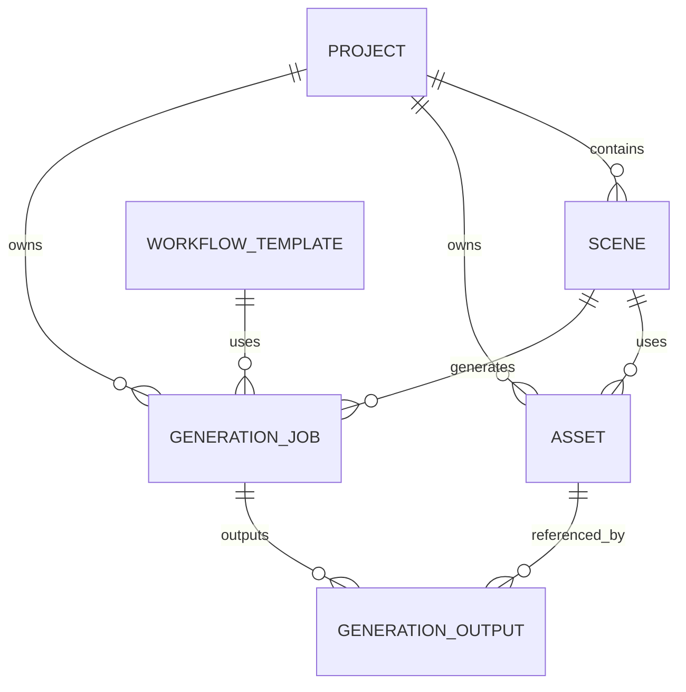

# 02_DATABASE — 数据库设计

## 1. Project

| 字段 | 类型 | 说明 |
|---|---|---|
| id | UUID | 主键 |
| name | string | 项目名 |
| description | text | 描述 |
| aspect_ratio | string | 16:9 / 9:16 |
| width | int | 宽 |
| height | int | 高 |
| fps | int | 帧率 |
| created_at | datetime | 创建时间 |
| updated_at | datetime | 更新时间 |

---

## 2. Scene

| 字段 | 类型 | 说明 |
|---|---|---|
| id | UUID | 主键 |
| project_id | UUID | 项目 |
| scene_number | int | 分镜序号 |
| title | string | 标题 |
| description | text | 内容 |
| prompt | text | Prompt |
| negative_prompt | text | Negative |
| seed | bigint/null | Seed |
| duration_seconds | float | 时长 |
| workflow_template_id | UUID/null | 默认 workflow |
| selected_asset_id | UUID/null | 最终版本 |
| status | string | draft/ready/generating/completed |
| created_at | datetime | 创建 |
| updated_at | datetime | 更新 |

约束：
- `(project_id, scene_number)` 唯一

---

## 3. Asset

| 字段 | 类型 | 说明 |
|---|---|---|
| id | UUID | 主键 |
| project_id | UUID | 项目 |
| scene_id | UUID/null | 分镜 |
| type | enum | image/video/audio/reference |
| role | string | first_frame/output/reference/voice/bgm |
| relative_path | string | 项目相对路径 |
| thumbnail_path | string/null | 缩略图 |
| mime_type | string | MIME |
| width | int/null | 宽 |
| height | int/null | 高 |
| duration_seconds | float/null | 时长 |
| size_bytes | bigint | 大小 |
| hash | string/null | 文件哈希 |
| created_at | datetime | 创建 |

---

## 4. WorkflowTemplate

| 字段 | 类型 |
|---|---|
| id | UUID |
| name | string |
| slug | string |
| version | string |
| template_path | string |
| manifest_path | string |
| is_enabled | bool |
| created_at | datetime |
| updated_at | datetime |

---

## 5. GenerationJob

| 字段 | 类型 |
|---|---|
| id | UUID |
| project_id | UUID |
| scene_id | UUID |
| workflow_template_id | UUID |
| workflow_version | string |
| comfy_prompt_id | string/null |
| status | enum |
| prompt_snapshot | text |
| negative_prompt_snapshot | text/null |
| seed | bigint/null |
| params_json | json |
| error_code | string/null |
| error_message | text/null |
| started_at | datetime/null |
| finished_at | datetime/null |
| created_at | datetime |

状态：
- pending
- queued
- running
- completed
- failed
- cancelled

---

## 6. GenerationOutput

允许一个任务产生多个输出。

| 字段 | 类型 |
|---|---|
| id | UUID |
| generation_job_id | UUID |
| asset_id | UUID |
| output_index | int |

---

## 7. Character（V0.2 可提前建表但不开放 UI）

| 字段 | 类型 |
|---|---|
| id | UUID |
| name | string |
| description | text |
| prompt_prefix | text |
| negative_prompt | text |
| default_workflow_id | UUID/null |
| created_at | datetime |

---

## 8. 关系

