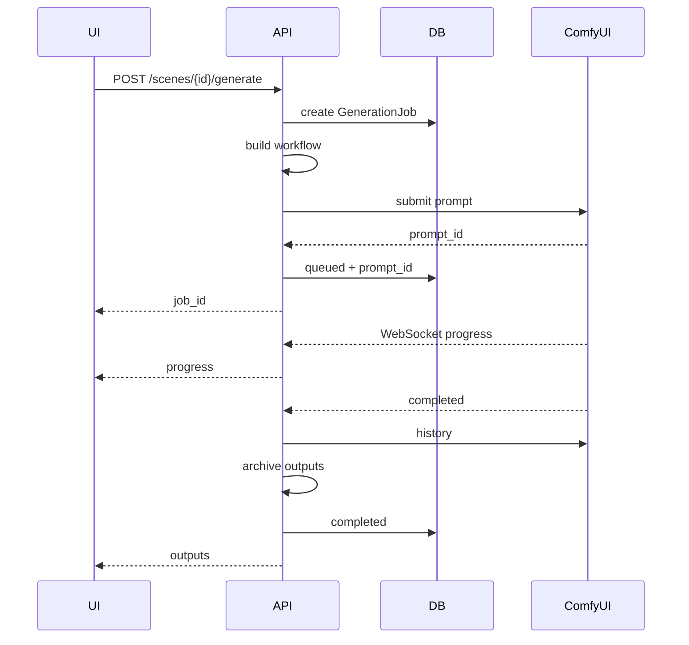

# 05_COMFYUI — ComfyUI 集成设计

## 1. 目标

导演台不替代 ComfyUI。

导演台仅：
- 选择模板
- 填参数
- 提交
- 监控
- 保存生成结果

---

## 2. ComfyUI Bridge

建议服务：

```text
services/
├─ comfyui_client.py
├─ comfyui_workflow.py
├─ comfyui_events.py
└─ generation_service.py
```

职责：

### comfyui_client
- health
- submit prompt
- queue
- history
- interrupt

### comfyui_workflow
- 加载模板
- 参数替换
- manifest 验证
- 输出最终 Prompt JSON

### comfyui_events
- WebSocket
- progress
- executing
- executed
- error

### generation_service
- Job 生命周期
- DB
- 输出文件归档
- 错误转换

---

## 3. Workflow Template

目录：

```text
workflows/
└─ minimax-h3-i2v/
   ├─ template.json
   └─ manifest.json
```

manifest：

```json
{
  "id": "minimax-h3-i2v",
  "name": "MiniMax H3 I2V",
  "version": "1.0.0",
  "description": "MiniMax H3 image-to-video workflow",
  "inputs": {
    "prompt": {
      "node_id": "12",
      "field": "text",
      "type": "string",
      "required": true
    },
    "seed": {
      "node_id": "45",
      "field": "noise_seed",
      "type": "integer",
      "required": true
    },
    "image": {
      "node_id": "7",
      "field": "image",
      "type": "asset"
    }
  }
}
```

---

## 4. 参数替换

不使用字符串搜索替换。

使用：
- node_id
- inputs[field]

例如：

```python
workflow["12"]["inputs"]["text"] = prompt
```

必须由 manifest 驱动。

---

## 5. 提交流程



---

## 6. 错误类型

至少归一化：

```text
COMFYUI_OFFLINE
COMFYUI_TIMEOUT
WORKFLOW_INVALID
WORKFLOW_NODE_MISSING
INPUT_FILE_MISSING
MODEL_MISSING
CUDA_OOM
EXECUTION_FAILED
OUTPUT_NOT_FOUND
CANCELLED
```

---

## 7. 重试

Retry 默认：
- 复制原 Job 参数快照
- 创建新 Job
- 不覆盖旧 Job

这样历史可追溯。

---

## 8. 输出归档

不要长期依赖 ComfyUI/output。

生成完成后，复制/移动到：

```text
projects/<project_id>/videos/
projects/<project_id>/images/
```

再建立 Asset。

---

## 9. CUDA OOM

UI 错误应该显示可理解文本：

```text
生成失败：显存不足（CUDA OOM）
Workflow：MiniMax H3 I2V
Scene：03
Job：...
```

并保留原始错误到日志。
